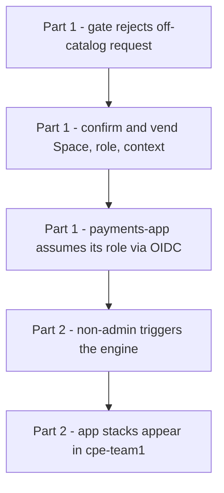

# Demo script — governed self-service on Spacelift

A presenter's runbook for the two patterns in this repo. Everything below is
**live** in the `jnesspace` account, tracking `platform-engineering` @ `main`.
Time: ~10 min full, ~3 min short.

**The one-sentence story:** product teams get real provisioning power — Spaces,
scoped cloud roles, app stacks — through narrow, audited, git-driven entry
points, and *no product-team user ever holds Space Admin or a cloud credential*.

Live links:
- Repo: https://github.com/Jnesspace/platform-engineering
- Spacelift: https://jnesspace.app.spacelift.io
- Stacks: `iam-factory`, `payments-app`, `onboarding-engine`, `app-stack-1/2`



*The demo arc: show the guardrail fail first, then the happy path, then the same no-admin split applied to launching.*

---

## Part 1 — iam-factory: catalog-governed role + Space vending (~5 min)

**The idea:** a developer requests an environment by adding one YAML file. The
factory mints a Space, a least-privilege AWS role trusted only by that Space's
OIDC identity, and wires it up — but only from a *platform-owned catalog* of
allowed permissions. A developer cannot grant themselves anything off-catalog.

### 1. Show the guardrail (the catalog)
Open `patterns/iam-factory/catalog.yaml`. **Say:** "This file is the allowed
universe. Developers pick set *names* — they never write raw IAM actions."

### 2. Show a developer request
Open `patterns/iam-factory/services/payments.yaml`:
```yaml
name: payments
permissions: [s3-readwrite, dynamodb, sqs, logs-write]
```
**Say:** "This is the whole developer-facing surface. Add a file, open a PR."

### 3. The money shot — the gate rejects an off-catalog request
On a branch, add `patterns/iam-factory/services/broken.yaml`:
```yaml
name: broken
permissions: ["*"]        # not a catalog entry
```
Push / trigger the `iam-factory` stack. **The run FAILS at plan** with:
> Service 'broken' requested permission set(s) not in catalog.yaml: *. Allowed sets: …

**Say:** "A developer cannot self-grant `*`. The guardrail is enforced
at plan time, before anything is created." Then delete `broken.yaml`.

### 4. The happy path
Trigger `iam-factory` (UI: **Trigger**, or `spacectl stack deploy --id iam-factory`).
- It plans: gate passes, computes each role's policy = union of its catalog sets.
- It **pauses at the sign-off gate** (autodeploy off) — the human approval.
- Confirm. It mints: the `payments`/`analytics` Spaces, `spacelift-payments`/
  `spacelift-analytics` IAM roles (each scoped to exactly its catalog sets), and
  auto-attached contexts carrying the role ARN.

### 5. Prove the vended role actually works (least privilege, via OIDC)
Open the `payments-app` stack (in the `payments` Space, label `aws-oidc`) → its
last run output:
```
assumed_identity = arn:aws:sts::025897764856:assumed-role/spacelift-payments/…
```
**Say:** "A stack in the payments Space assumed *its* role via OIDC — no static
keys — and can do only what the catalog allowed. Because trust is pinned to the
Space's OIDC `sub`, it physically cannot assume another Space's role."

---

## Part 2 — nonadmin-launcher: self-service without Space Admin (~4 min)

**The idea:** product teams provision stacks into their own Space by *triggering*
an admin-owned engine — without ever holding Space Admin.

### 1. Show where the privilege lives (not on a user)
`bootstrap/nonadmin-launcher/main.tf` → the `spacelift_role_attachment` that binds
the system **Space admin** role to the **engine stack**, scoped to the team Space.
**Say:** "This one object is the entire elevation. It's on the *stack*, created
once by an admin. No user has it."

### 2. Show what a product-team user gets
The `cpe-team-consumer` role = `SPACE_READ` + `RUN_TRIGGER` (+ `RUN_CONFIRM`),
attached **stack-scoped to the engine only**. **Say:** "No `SPACE_ADMIN`, no
`STACK_UPDATE` — they can't edit the `env:*` labels our policies depend on."

### 3. Show the git-tracked shopping list
Open `patterns/nonadmin-launcher/engine/requests/` — one YAML per app stack
(`app-stack-1.yaml`, `app-stack-2.yaml`). **Say:** "Same as the factory: teams
add reviewed-in-git *data*, never code."

### 4. Trigger it
Trigger `onboarding-engine`. Its run gets a short-lived injected token carrying
the stack's Space-admin-on-the-team-Space permission, reads the shopping list,
and creates the `app-stack-*` inside `cpe-team1` — **independent of who triggered
it**. (Money shot: add `requests/app-stack-3.yaml`, push, watch a third stack
appear.)

**Say:** "The triggering identity never had admin. The elevation came from the
stack, not the person."

---

## The "why" — the question this pattern answers

> "Can a non-admin user deploy a governed Template that creates a stack with
> elevated permissions, without the user already having those permissions?"

**Not by having the user's Template create the elevation** — a Blueprint runs
with the deploying user's permissions, and you can't grant a role you don't hold.
That check is the anti-escalation boundary working correctly (otherwise any
non-admin could edit the template to elevate themselves).

**The resolution is to decouple *creating* the elevation (admin, once) from
*using* it (non-admin, always).** The elevation is bound to the stack by an
admin; users only trigger. Both patterns here are built on exactly that split.
See `patterns/nonadmin-launcher/README.md` and `docs/nonadmin-launcher-privilege-memo.md`.

---

## Reset between demos

- **iam-factory:** the `payments`/`analytics` Spaces + roles persist. To re-show
  the gate, add/remove a `broken.yaml` on a branch. To re-vend, just re-trigger.
- **Not production-safe yet:** see `docs/hardening-backlog.md` (branch protection,
  approval/plan policies, private worker pool) — call this out as the roadmap.
