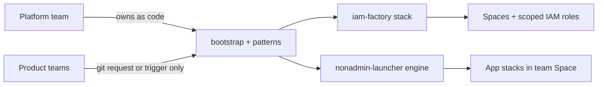
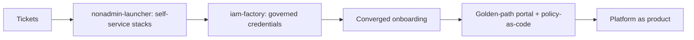

# platform-engineering

Governed self-service on Spacelift: the platform team owns the guardrails as
code, and product teams get real provisioning power through narrow, audited
entry points — never admin rights. Every privilege in this repo is
attached to a *stack* or minted from a *catalog*; no person on a product team
holds Space Admin or an IAM credential.

> **Status: PoC.** Not yet production-safe — the deferred security work is
> tracked in **[docs/hardening-backlog.md](docs/hardening-backlog.md)**. Read
> it before deploying beyond a demo account.

## The two patterns

### iam-factory — Space + scoped AWS role vending

One admin stack turns a git-tracked shopping list (`services/*.yaml`) into, per
service: a Spacelift Space, a per-Space IAM role trusted **only by that
Space's OIDC `sub`**, and an auto-attached context handing the role ARN to
labeled stacks. A developer picks permission sets from the platform-owned
`catalog.yaml`; a **plan-time gate blocks anything off-catalog**, and a
permissions boundary hard-caps the role at runtime. Per-Space OIDC trust means
a stack can never assume another Space's role, no matter what ARN it types.

### nonadmin-launcher — self-service provisioning without Space Admin

Product teams trigger an admin-owned **engine stack** that vends app stacks
into their Space. The elevation is a single object: a Space-admin role binding
**on the engine stack**, scoped to the team Space — created once by the
platform team. Runs act with that binding's short-lived injected token,
independent of who triggered them; the gate is git ownership of the engine
code plus an explicit confirm step (`autodeploy = false`). Teams hold only
read + trigger/confirm, stack-scoped to the engine.



*One shape, two patterns: the platform team owns the guardrails; product teams hold only a narrow, audited entry point.*

## The DevX progression

These patterns are two rungs of one ladder. Each rung pushes more privilege into
admin-owned, git-driven, policy-gated automation, so the developer's surface
stays a narrow, audited request or trigger.

1. **Tickets** (where most teams start) — devs file requests; the platform team
   manually creates Spaces, roles, and stacks. Slow, inconsistent, a bottleneck.
2. **Self-service provisioning — `nonadmin-launcher`** — devs trigger an
   admin-owned engine to get stacks in their Space, holding no admin. Kills the
   "give me a stack" queue.
3. **Governed credentials — `iam-factory`** — devs request cloud access from a
   git-tracked catalog; the factory vends least-privilege, OIDC-trusted roles
   per Space. Kills the "give me cloud access" queue, with a plan-time gate.
4. **Converged onboarding** — one "onboard my service" request vends the Space +
   scoped OIDC role + launcher together. The dev writes one YAML; everything
   privileged is automation behind it.
5. **Golden path** — a Blueprint/portal front-end on top (this is the "Template"
   ask — done right, sitting *on* the decoupled elevation, not creating it), plus
   policy-as-code enforcing the catalog and gates server-side (see
   [docs/hardening-backlog.md](docs/hardening-backlog.md)).
6. **Platform as product** — self-service across the lifecycle (provision →
   deploy → observe → decommission), measured by DevX/DORA metrics.

The throughline is one rule: **decouple *creating* a privilege from *using* it.**



*Where this repo sits: rungs 2 and 3 are built and live; 4-6 are the roadmap.*

## Repo map

```
patterns/
├─ iam-factory/              # code the factory stack runs (catalog, services/, gate, roles)
├─ nonadmin-launcher/
│  ├─ README.md              # the pattern, end to end
│  └─ engine/                # code the engine stack runs (requests/ shopping list + app-example/)
└─ app-factory/              # shopping-list engine: platform.yaml -> modules + ONE app IAM role
modules/
└─ {aws,azure,gcp}/{object-storage,database,secrets,compute}/   # dual-purpose wrappers (uniform id/name/endpoint/access; AWS adds iam_policy_json)
blueprints/
└─ object-storage.yaml       # Spacelift Blueprint: same module, filled via a form (ticketing path)
examples/
└─ jimmy-app/                # what an app repo ships: Dockerfile + platform.yaml shopping list
bootstrap/
├─ iam-factory/              # root-admin, one-time: platform-admin Space + factory stack + role binding + integration
└─ nonadmin-launcher/        # root-admin, one-time: Spaces, engine stack, the role binding, team role
docs/
├─ nonadmin-launcher-privilege-memo.md   # design memo: why the binding, verified against the API
└─ hardening-backlog.md      # deferred security items — READ THIS
```

**Where the new pieces sit on the ladder:** `patterns/app-factory/` is rung 4
(converged onboarding — one `platform.yaml` vends an app's resources plus its
scoped IAM role), and `modules/` + `blueprints/` serve rung 5 (golden path /
ticketing — the same modules, filled via a Blueprint form instead of code).

**Who owns what:** the platform team owns `bootstrap/` and `patterns/`;
product teams only trigger.
