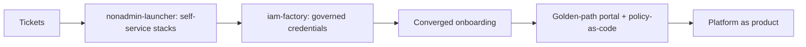

# platform-engineering

Governed self-service on Spacelift: the platform team owns the guardrails as
code; product teams get real provisioning power through narrow, audited entry
points — never admin rights or IAM credentials.

> **Status: PoC.** The guardrails are now implemented and verified, but nothing
> is enforced until an operator applies the new roots and sets GitHub branch
> protection. Two items remain genuinely open — read
> [docs/hardening-backlog.md](docs/hardening-backlog.md) before deploying beyond
> a demo account.

**📖 [docs/WORKFLOWS.md](docs/WORKFLOWS.md)** — every workflow in this repo
(bootstrap, the three vending engines, the deploy rung, blueprints,
promotion) with diagrams and step-by-step operations. Start there.

## Grab what you need

| Section | What it is / when you'd grab it |
|---|---|
| [`patterns/`](patterns/) | The three engines: `iam-factory` (vends Spaces + OIDC-scoped AWS roles from a catalog), `nonadmin-launcher` (admin-owned engine vends app stacks; teams only trigger), `app-factory` (one `platform.yaml` → cloud resources + one least-privilege app role). |
| [`patterns/app-deploy/`](patterns/app-deploy/) | The k8s deploy rung: runs the app image with app-factory's outputs wired in — IRSA to the app role, bucket/secret refs as env. No static creds in the pod. |
| [`modules/`](modules/) | Dual-purpose wrappers, `{aws,azure,gcp} × {object-storage,database,secrets,compute}`, with a uniform `id/name/endpoint/access` interface (AWS adds `iam_policy_json`). Grab when composing an engine or a Blueprint. |
| [`schedules/`](schedules/) | Spacelift scheduling primitives: scheduled re-apply for secret rotation (flagship), nightly runs, cron tasks, ephemeral-env TTL teardown, drift detection. |
| [`policies/`](policies/) | Centralized policy-as-code: plan, approval, push, login, trigger, notification — with Rego unit tests. Grab when enforcing gates server-side instead of in engine code. |
| [`bootstrap/governance/`](bootstrap/governance/) | The delivery plane that makes `policies/` real: discovers every `.rego`, publishes it as a live Spacelift policy, auto-attaches it, and **fails its own plan** if an `elevated` stack lacks a private worker pool, deletion protection, or policy reach. |
| [`blueprints/`](blueprints/) | Ticketing / self-service forms: the same modules filled via a Spacelift Blueprint instead of code. |
| [`roles/`](roles/) | RBAC as code: requester / approver / reader roles for the governed workflows. |
| [`worker-pools/`](worker-pools/) | Private worker pools for the elevated (engine/factory) stacks. |
| [`bootstrap/`](bootstrap/) | Root-admin, ONE-TIME setup per pattern: Spaces, the privileged stack, and its role binding. The only place elevation is created. |
| [`bootstrap/environments/`](bootstrap/environments/) | `for_each` over an env list → per-env Space + app-factory stack tracking `dev`/`stage`/`main` — the git-promotion (dev→stage→prod) model. |
| [`examples/`](examples/) | `jimmy-app` — what an app repo ships (Dockerfile + `platform.yaml` shopping list). |
| [`docs/`](docs/) | [WORKFLOWS.md](docs/WORKFLOWS.md) — all workflows with diagrams + operations; plus the hardening backlog. |

## The DevX progression

One rule throughout: **decouple *creating* a privilege from *using* it.** Each
rung pushes more privilege into admin-owned, git-driven, policy-gated
automation.

1. **Tickets** — manual platform-team fulfillment; slow bottleneck.
2. **Self-service stacks — `nonadmin-launcher`** — devs trigger an admin-owned engine; no admin held. *(built)*
3. **Governed credentials — `iam-factory`** — catalog-gated, OIDC-trusted per-Space roles. *(built)*
4. **Converged onboarding — `app-factory`** — one YAML vends resources + the scoped app role; `app-deploy` then runs the image on k8s with them wired in — the "app just deploys" step. *(built)*
5. **Golden path** — Blueprint/portal front-end + policy-as-code gates (`blueprints/`, `policies/`).
6. **Platform as product** — full lifecycle self-service, measured by DevX/DORA metrics.



## Repo map

```
patterns/
├─ iam-factory/              # code the factory stack runs (catalog, services/, gate, roles)
├─ nonadmin-launcher/
│  ├─ README.md              # the pattern, end to end
│  └─ engine/                # code the engine stack runs (requests/ shopping list + app-example/)
├─ app-factory/              # shopping-list engine: platform.yaml -> modules + ONE app IAM role
└─ app-deploy/               # k8s deploy rung: runs the app image with app-factory's outputs wired in
modules/
└─ {aws,azure,gcp}/{object-storage,database,secrets,compute}/   # dual-purpose wrappers
schedules/                   # scheduling primitives: secret-rotation (flagship), scheduled-run/task, ephemeral TTL, drift detection
policies/                    # centralized policy-as-code: plan/approval/push/login/access/trigger/notification
blueprints/                  # Spacelift Blueprints: same modules, filled via a form (ticketing path)
roles/                       # RBAC as code: requester/approver/reader
worker-pools/                # private worker pools for elevated stacks
bootstrap/
├─ environments/             # for_each over an env list: per-env Space + app-factory stack tracking dev/stage/main (git-promotion model)
├─ governance/               # publishes + auto-attaches every policies/*.rego; audits that elevated stacks are actually governed
├─ blueprints/               # publishes blueprints/ as live Spacelift Blueprints
├─ iam-factory/              # root-admin, one-time: platform-admin Space + factory stack + role binding
└─ nonadmin-launcher/        # root-admin, one-time: Spaces, engine stack, role binding
.github/                     # CI: fmt/validate across every root, tflint, checkov+trivy, opa test, gitleaks, SHA-pinned actions
├─ CODEOWNERS                # platform-team review on every privilege-bearing path
└─ BRANCH_PROTECTION.md      # the ruleset an operator must apply to main (Stage 1 today, Stage 2 with a second maintainer)
examples/
└─ jimmy-app/                # what an app repo ships: Dockerfile + platform.yaml shopping list
docs/
├─ WORKFLOWS.md              # every workflow: stages, run lifecycle, diagrams + operations
└─ hardening-backlog.md      # deferred security items — READ THIS
```

**Who owns what:** the platform team owns `bootstrap/`, `patterns/`,
`policies/`, `roles/`, `worker-pools/`, and `.github/`; product teams only
submit requests and trigger. `.github/` is on that list deliberately — whoever
can edit a workflow can run code in this repo's context, so CI is
privilege-bearing too.

**Apply order** (values are required variables now; see each root's
`terraform.tfvars.example`):

```
1. worker-pools/
2. bootstrap/iam-factory/  |  bootstrap/nonadmin-launcher/  |  bootstrap/environments/
3. bootstrap/governance/   # takes Space IDs from step 2 and audits step 2's stacks
4. roles/                  # takes Space IDs from step 2
   bootstrap/blueprints/   # no ordering constraint
```
