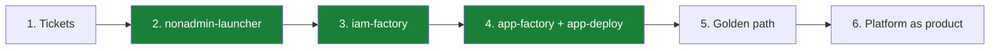
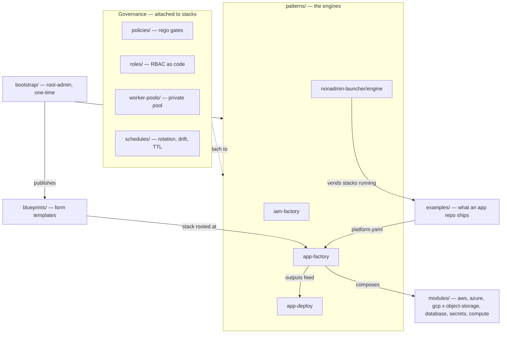
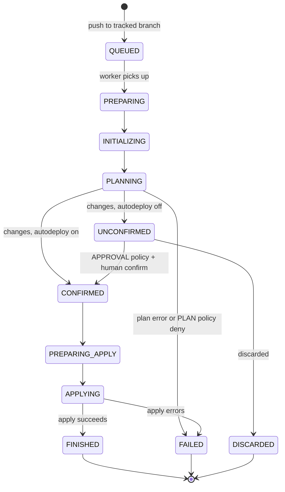
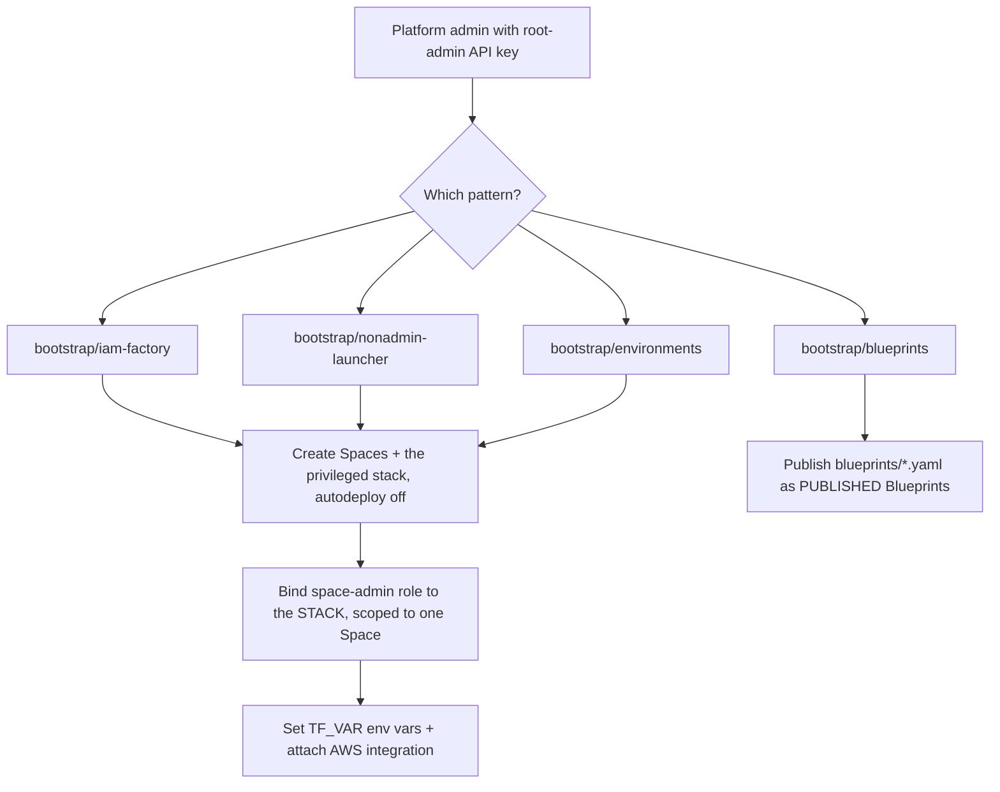
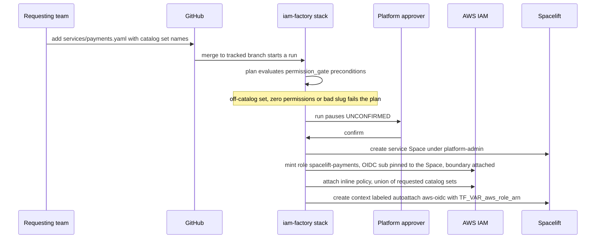
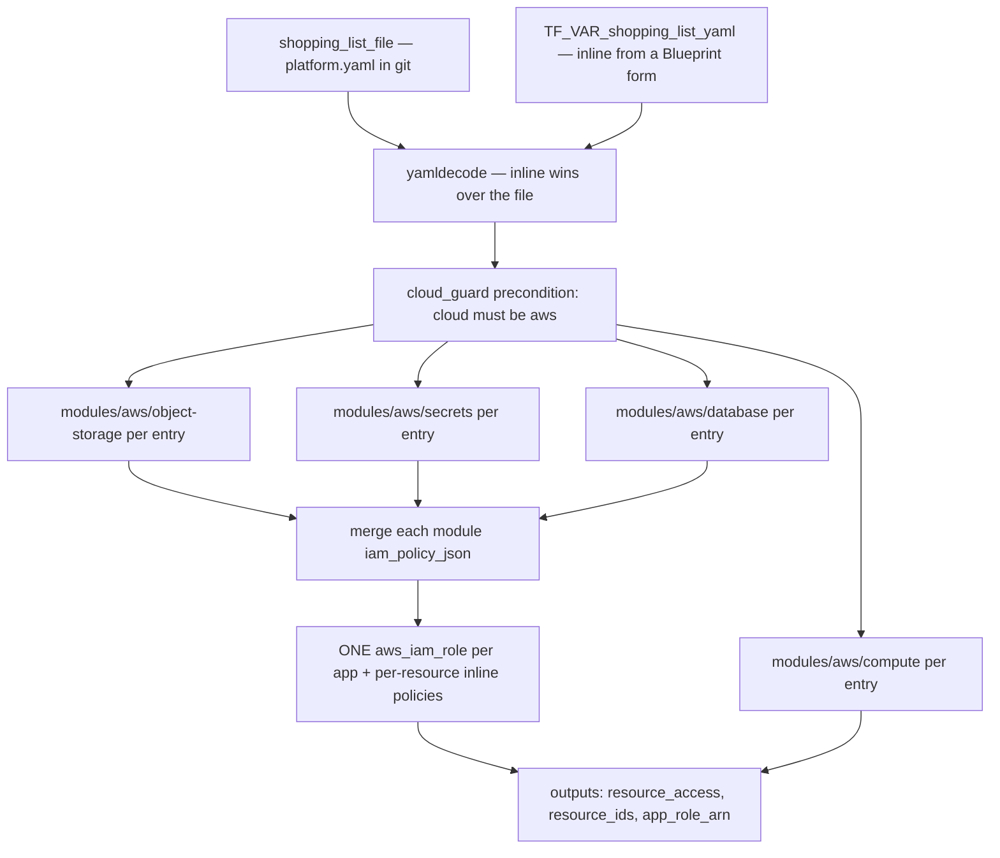
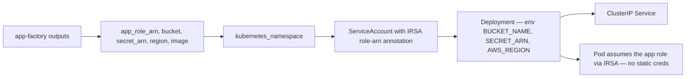
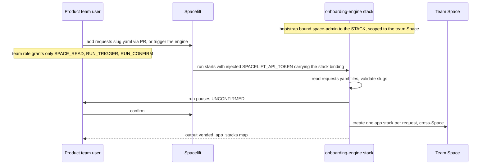
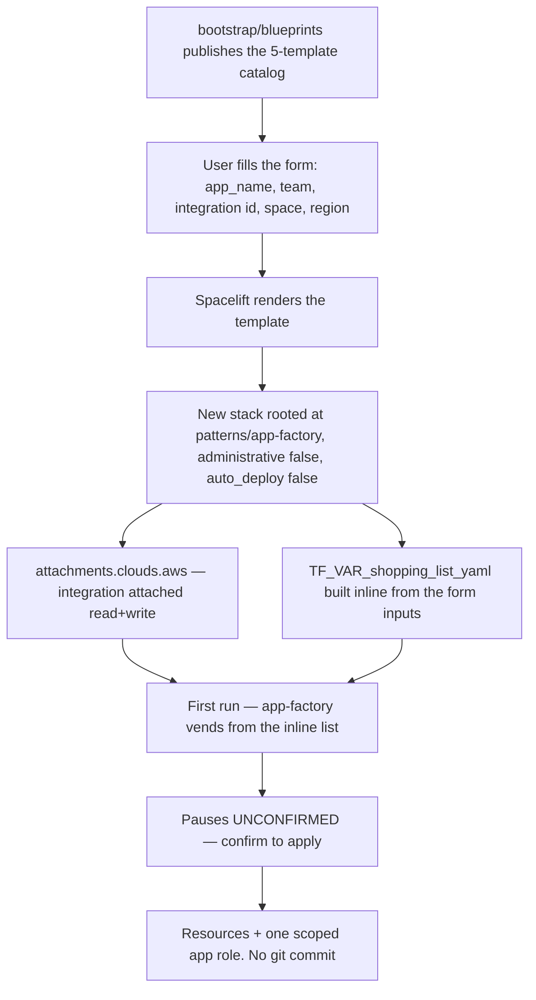
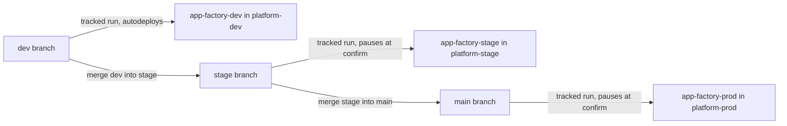

# Workflows

How work moves through this repo: the stages of maturity, the layers, the run
lifecycle every operation rides on, and the seven concrete workflows — each
with a diagram and its exact operations, grounded in the code.

- [1. Stages of work — the DevX ladder](#1-stages-of-work--the-devx-ladder)
- [2. Repo topology — layers and dependencies](#2-repo-topology--layers-and-dependencies)
- [3. The Spacelift run lifecycle](#3-the-spacelift-run-lifecycle)
- [4. Workflows](#4-workflows)
  - [4.1 Bootstrap — admin, one-time](#41-bootstrap--admin-one-time)
  - [4.2 iam-factory vend — governed credentials](#42-iam-factory-vend--governed-credentials)
  - [4.3 app-factory vend — the shopping list](#43-app-factory-vend--the-shopping-list)
  - [4.4 app-deploy — the k8s rung](#44-app-deploy--the-k8s-rung)
  - [4.5 nonadmin-launcher — self-service stacks without admin](#45-nonadmin-launcher--self-service-stacks-without-admin)
  - [4.6 Blueprint self-service — the form path](#46-blueprint-self-service--the-form-path)
  - [4.7 Environment promotion — dev to stage to prod](#47-environment-promotion--dev-to-stage-to-prod)
- [5. Governance operations](#5-governance-operations)

---

## 1. Stages of work — the DevX ladder

One rule throughout: **decouple creating a privilege from using it.** Each rung
pushes more privilege into admin-owned, git-driven, policy-gated automation.

| Rung | What it is | Status |
|---|---|---|
| 1. Tickets | Manual platform-team fulfillment; slow bottleneck | superseded |
| 2. Self-service stacks — `nonadmin-launcher` | Devs trigger an admin-owned engine; no admin held | **built** |
| 3. Governed credentials — `iam-factory` | Catalog-gated, OIDC-trusted per-Space roles | **built** |
| 4. Converged onboarding — `app-factory` + `app-deploy` | One YAML vends resources + the scoped app role; the image runs on k8s with them wired in | **built** |
| 5. Golden path | Blueprint/portal front-end + policy-as-code gates | components in repo (`blueprints/`, `policies/`) |
| 6. Platform as product | Full lifecycle self-service, measured by DevX/DORA metrics | aspirational |

## 2. Repo topology — layers and dependencies

Four layers: `modules/` are the leaf building blocks; `patterns/` engines,
`blueprints/`, and `examples/` consume them; `bootstrap/` is the root-admin,
one-time layer that stands the engine stacks up; `policies/`, `roles/`,
`worker-pools/`, and `schedules/` are governance attached to stacks from the
outside.

- `modules/{aws,azure,gcp}/{object-storage,database,secrets,compute}` — uniform
  `id/name/endpoint/access` interface; AWS modules also emit `iam_policy_json`.
- `patterns/` — the three vending engines plus the deploy rung.
- `bootstrap/` — the ONLY place elevation is created (role bindings on stacks).
- Governance dirs wrap any stack; nothing in `patterns/` depends on them.

## 3. The Spacelift run lifecycle

Every workflow below ultimately executes as a Spacelift run on a stack. A git
push is what starts it (mediated by a GIT_PUSH policy); the run then walks this
state machine. Proposed runs (from PRs) stop after planning.

Operations:

1. A git push or PR event reaches Spacelift; the **GIT_PUSH policy** decides
   `track` (deployable tracked run), `propose` (plan-only), or `ignore`
   (`policies/push/`).
2. **QUEUED** — the run waits for a worker (public, or the private
   `elevated-engines` pool for engine stacks).
3. **PREPARING → INITIALIZING** — workspace checkout, hooks, `terraform init`.
4. **PLANNING** — `terraform plan`; in-code gates (`terraform_data`
   preconditions) fail the run here.
5. **PLAN policies** evaluate the plan JSON (`policies/plan/`); any `deny`
   fails the run. Proposed runs end here.
6. If the stack has `autodeploy = false` (every engine stack in this repo, and
   stage/prod), the run pauses at **UNCONFIRMED** — the sign-off gate.
7. The **APPROVAL policy** evaluates reviews (`policies/approval/` — e.g. the
   triggerer cannot be the sole approver); a human confirms or discards.
8. **CONFIRMED → PREPARING_APPLY → APPLYING** — `terraform apply` executes with
   the run's credentials (OIDC role, integration, or injected API token).
9. **FINISHED** on success; **FAILED** on error. The **TRIGGER policy** may fan
   out to dependent stacks; the **NOTIFICATION policy** routes failures to
   Slack.

## 4. Workflows

### 4.1 Bootstrap — admin, one-time

A platform admin with a **root-admin API key** applies one of the
`bootstrap/*` roots locally, once per pattern. This is the only place
elevation is created — always as a role binding on a **stack**, never on a
user. Grounded in `bootstrap/iam-factory/main.tf`,
`bootstrap/nonadmin-launcher/main.tf`, `bootstrap/environments/`, and
`bootstrap/blueprints/main.tf`.

Common operations (iam-factory and nonadmin-launcher):

1. Authenticate with `SPACELIFT_API_KEY_ENDPOINT / _ID / _SECRET` (root-admin).
2. Resolve the system `space-admin` role by slug (`data.spacelift_role`) — no
   hardcoded ULIDs.
3. Create the Space(s):
   - iam-factory: `platform-admin` under root, `inherit_entities = true` (so
     the factory reaches the root-level AWS integration).
   - nonadmin-launcher: `platform` (governance plane) and the team Space, both
     `inherit_entities = false` (no root leakage — disabling inheritance is
     root-admin-only, which is why it happens here).
4. Create the privileged stack pointing at its pattern directory
   (`patterns/iam-factory` or `patterns/nonadmin-launcher/engine`) with
   `autodeploy = false` (runs pause at the sign-off gate) and
   `protect_from_deletion = true`; the engine stack also enables well-known
   secret masking.
5. **The elevation**: `spacelift_role_attachment` binds `space-admin` to the
   stack, scoped to exactly one Space (`platform-admin` for the factory; the
   team Space for the engine).
6. Set the stack's config as environment variables — factory:
   `TF_VAR_parent_space_id`, `TF_VAR_account_subdomain`,
   `TF_VAR_create_oidc_provider`, `AWS_DEFAULT_REGION`; engine:
   `TF_VAR_team_space_id`, `TF_VAR_vended_repository`, `TF_VAR_vended_branch`,
   `TF_VAR_vended_project_root`.
7. iam-factory only: attach the AWS integration (read + write) so factory runs
   can mint IAM roles.
8. nonadmin-launcher only: create the non-admin `team_consumer` role
   (`SPACE_READ`, `RUN_TRIGGER`, `RUN_CONFIRM` — no `SPACE_ADMIN`, no
   `STACK_UPDATE`); its stack-scoped attachment to real users/groups is
   activated separately.

Other bootstrap roots:

- `bootstrap/environments` — `for_each` over the env map; see
  [4.7](#47-environment-promotion--dev-to-stage-to-prod).
- `bootstrap/blueprints` — `for_each` over a five-entry catalog
  (object-storage, database, secrets, compute, app) creating
  `spacelift_blueprint` resources with `state = "PUBLISHED"`, each template
  read from `blueprints/<key>.yaml`; see
  [4.6](#46-blueprint-self-service--the-form-path).

### 4.2 iam-factory vend — governed credentials

A team asks for cloud access by adding a YAML file; the factory mints a Space,
an OIDC-pinned scoped IAM role, and an auto-attached context — capped at plan
time by the catalog gate and at runtime by a permissions boundary. Grounded in
`patterns/iam-factory/main.tf`, `catalog.yaml`, `services/*.yaml`.

Operations:

1. The requester adds `services/<slug>.yaml` — `name`, `description`, and a
   `permissions:` list of set names from `catalog.yaml` (omitting the block
   grants `var.default_permission_sets`, default `["readonly"]`) — and pushes
   or opens a PR. `catalog.yaml` IS the allowed universe; expanding it is a
   platform-reviewed change.
2. The merge starts a tracked run on the factory stack. Locals load every
   `services/*.yaml` and `*.yml`, decode the catalog, and compute per service:
   `requested_sets`, `unknown_sets` (names missing from the catalog), and
   `granted_actions` (distinct union of the matched sets' IAM actions).
3. **Plan-time gate** — `terraform_data.permission_gate` preconditions fail
   the plan (before anything is minted, needing no credentials) if: any
   requested set is off-catalog; the service resolves to zero permissions; or
   the slug doesn't match `^[a-z0-9-]{1,54}$` (the role name is
   `spacelift-<slug>`, 64-char cap).
4. `autodeploy = false` pauses the run at **UNCONFIRMED**; a platform human
   confirms.
5. Apply ensures the shared plumbing: the Spacelift **OIDC provider** in AWS
   (created when `create_oidc_provider`, otherwise referenced) and the
   `spacelift-space-boundary` **permissions boundary** — Allow `*` with an
   explicit Deny on `iam:*`, `organizations:*`, `account:*`, `sts:AssumeRole`,
   `sts:AssumeRoleWithSAML`.
6. Per service, apply creates a **Space** (child of the platform-admin Space
   unless `parent_space` overrides; `inherit_entities = true`).
7. Per service, apply mints **`aws_iam_role.spacelift-<slug>`**: trust policy
   allows `sts:AssumeRoleWithWebIdentity` from the OIDC provider only when
   `aud` equals the account subdomain and `sub` matches
   `space:<space-id>:*:scope:write` or `:read` — the role is pinned to that
   one Space; the boundary is attached.
8. Per service, an **inline policy** grants exactly `granted_actions` plus a
   `sts:GetCallerIdentity` baseline so the AWS provider can init; the boundary
   still caps everything.
9. Per service, a **context** labeled `autoattach:aws-oidc` is created in the
   Space carrying `TF_VAR_aws_role_arn` and `AWS_DEFAULT_REGION` — any stack in
   the Space labeled `aws-oidc` gets the role hands-free.
10. Outputs: `vended` (space ID, role ARN, permission sets per service),
    `granted_actions`, `oidc_provider_arn`, `boundary_policy_arn`.
    **Deprovision** = delete the service file and run again.

### 4.3 app-factory vend — the shopping list

One `platform.yaml` in — cloud resources plus ONE least-privilege app role
out. Two entry paths feed the same engine: a file in git (GitOps) or inline
YAML from a Blueprint form. Grounded in `patterns/app-factory/main.tf`,
`iam.tf`, `variables.tf`.

Operations:

1. Resolve the spec: `var.shopping_list_yaml` (inline, the Blueprint/form
   path) **wins over** `var.shopping_list_file` (the git path, default
   `examples/jimmy-app/platform.yaml`); `yamldecode` yields `name`, `cloud`
   (default `aws`), and a `resources:` map whose keys map 1:1 to
   `modules/<cloud>/<primitive>`.
2. **`terraform_data.cloud_guard`** fails the plan fast if the list requests a
   cloud this engine doesn't serve (each cloud gets its own root because
   Terraform eagerly configures every declared provider).
3. `for_each` over each resource kind instantiates the matching module —
   `object_storage`, `secrets`, `database`, `compute` — naming everything
   `<app_name>-<resource-name>` and tagging `app` + `managed_by: app-factory`.
4. `iam.tf` merges each module's `iam_policy_json` output into one map, keyed
   `s3-<name>` / `secret-<name>` / `db-<name>` (compute contributes no
   policy).
5. One **`aws_iam_role.app`** (`<app_name>-app`) is created — EC2 trust as the
   simple default; the k8s rung swaps in IRSA trust.
6. Each aggregated policy attaches to that single role as an inline
   `aws_iam_role_policy` — the app gets exactly what its resources grant,
   nothing more.
7. Outputs: `resource_access` (sensitive map `"<primitive>/<name>"` to the
   module's `access` object), `resource_ids`, and `app_role_arn` — consumed by
   app-deploy.

### 4.4 app-deploy — the k8s rung

Runs the app image with what app-factory vended wired in: the role via IRSA,
the resources by reference as env vars. No static credentials anywhere in the
pod. Grounded in `patterns/app-deploy/main.tf` and `variables.tf`.

Operations:

1. Inputs come straight from app-factory's outputs: `app_role_arn`, `bucket`
   (`resource_access["object_storage/<name>"].bucket`), `secret_arn`
   (`resource_access["secrets/<name>"].secret_ref`), plus the app `image` and
   `region`. Cluster connection is supplied by the run (kubeconfig on the
   worker), not configured in code.
2. Create the app **namespace** (defaults to `app_name`).
3. Create the **ServiceAccount** annotated
   `eks.amazonaws.com/role-arn = app_role_arn` — the IRSA hook by which the
   pod assumes the vended role.
4. Create the **Deployment** using that ServiceAccount; the container gets the
   vended resources **by reference** as env — `BUCKET_NAME`, `SECRET_ARN`,
   `AWS_REGION`. The app fetches the secret VALUE from Secrets Manager at
   runtime via the role.
5. Expose it with a **ClusterIP Service** on the container port.

### 4.5 nonadmin-launcher — self-service stacks without admin

The rung-2 pattern: an admin-owned engine stack holds the only elevation (a
Space-admin role binding scoped to the team Space); product users hold a
trigger-only role. The run's injected token carries the stack's binding — so
stacks appear in the team Space while no deployer ever holds admin. Grounded
in `patterns/nonadmin-launcher/engine/main.tf` and
`bootstrap/nonadmin-launcher/main.tf`.

Operations:

1. Precondition (from bootstrap): the engine stack has `space-admin` bound to
   **the stack**, scoped to the team Space; team members hold `team_consumer`
   (`SPACE_READ`, `RUN_TRIGGER`, `RUN_CONFIRM` — cannot edit env or attach
   roles).
2. A team member adds `requests/<slug>.yaml` (data, not code — just `name` and
   an optional `project_root` override) via PR, or triggers the engine run
   directly.
3. The run starts; the Spacelift provider authenticates via the run's injected
   `SPACELIFT_API_TOKEN`, which carries the stack's role-binding permissions —
   this is where the (scoped) power comes from.
4. Locals build one app-stack entry per `requests/*.yaml`; a lifecycle
   precondition rejects slugs not matching `^[a-z0-9-]+$`.
   `TF_VAR_team_space_id` has no default so a missing value fails loudly.
5. `autodeploy = false` pauses the run **UNCONFIRMED**; a confirm (by anyone
   holding `RUN_CONFIRM`) proceeds.
6. Apply creates one `spacelift_stack` per request **in the team Space** —
   tracking the bootstrap-configured repo/branch and the `app-example`
   project root by default, `autodeploy = false`, `protect_from_deletion`,
   labeled `env:d` and `vended-by:onboarding-engine`.
7. Output `vended_app_stacks` maps each request to the created stack ID —
   proof of cross-Space creation with no user-held admin.

### 4.6 Blueprint self-service — the form path

The same app-factory engine, filled via a Spacelift Blueprint form instead of
a committed file — the "ticketing" front door. Nothing is committed to git
(contrast the GitOps path in 4.3, which is). Grounded in `blueprints/*.yaml`
and `bootstrap/blueprints/main.tf`.

Operations:

1. (One-time) `bootstrap/blueprints` publishes five Blueprints —
   object-storage, database, secrets, compute, and the `app` bundle — each
   `state = "PUBLISHED"`, template loaded from `blueprints/<key>.yaml`, in the
   Space that controls who sees the catalog.
2. A user opens a Blueprint in Spacelift and fills the inputs: `app_name`,
   `team`, `aws_integration_id`, `space_id`, `region` (a select).
3. Spacelift renders the template and **creates a stack** named from the
   inputs, rooted at `patterns/app-factory` on `main` in this repo —
   `administrative: false`, `auto_deploy: false`, Terraform 1.5.7 with managed
   state.
4. The template's `attachments.clouds.aws` attaches the chosen AWS integration
   (read + write) so runs can create resources.
5. The template sets `TF_VAR_shopping_list_yaml` **inline** from the form
   (e.g. the app bundle: one `uploads` bucket + one `app-secrets` secret),
   plus `TF_VAR_region` and `AWS_DEFAULT_REGION`.
6. The stack's first run executes the app-factory workflow
   ([4.3](#43-app-factory-vend--the-shopping-list)) — the inline YAML wins
   over any file — and pauses at the confirm gate before applying.
7. Result: the same modules, the same single scoped app role — reached through
   a form. The stack (not a YAML in git) is the record of the request.

### 4.7 Environment promotion — dev to stage to prod

`bootstrap/environments` turns the env list into per-env planes; promotion is
just merging between branches, with autodeploy deciding which envs gate.
Grounded in `bootstrap/environments/{main.tf,variables.tf}` and
`bootstrap/environments/env/main.tf`.

Operations:

1. (One-time) the root applies `module.env` `for_each` over
   `var.environments` — `dev` tracks branch `dev` with `autodeploy = true`;
   `stage` and `prod` track `stage`/`main` with `autodeploy = false`. Adding
   an entry to this map is the whole "add an environment" procedure.
2. Each env module creates: a `platform-<env>` Space (`inherit_entities =
   true` to reach the root AWS integration), an `app-factory-<env>` stack
   rooted at `patterns/app-factory` tracking the env's branch (labeled
   `env:<env>` — protected by the `protect-env-labels` plan policy), the AWS
   integration attachment, and env vars: an env-suffixed inline
   `TF_VAR_shopping_list_yaml` (`demo-<env>` — collision-safe names on one
   shared account), `TF_VAR_region`, `AWS_DEFAULT_REGION`.
3. Day-to-day: merge work to `dev` — `app-factory-dev` runs and **applies
   unattended**.
4. Promote to stage: merge `dev` into `stage` — `app-factory-stage` plans and
   pauses **UNCONFIRMED**; a human (subject to the APPROVAL policies)
   confirms.
5. Promote to prod: merge `stage` into `main` — same gate on
   `app-factory-prod`; stacks labeled `env:prod` can additionally require two
   approvals via `policies/approval/require-prod-approval.rego`.
6. Isolation note: all three envs share one demo AWS integration here; real
   isolation is each env pointing `aws_integration_id` at **its own AWS
   account**.

## 5. Governance operations

Server-side gates and primitives attached to stacks — enforcement lives here,
not in engine code.

| Item | Type | When it fires | What it enforces |
|---|---|---|---|
| `policies/plan/enforce-required-tags.rego` | PLAN | every plan | deny resources created/updated without `Environment`, `Project`, `Owner` tags |
| `policies/plan/deny-privileged-iam.rego` | PLAN | every plan | deny creating Spacelift roles/role attachments and long-lived IAM users/keys — request via the platform team |
| `policies/plan/cap-new-resources.rego` | PLAN | every plan | deny plans creating more than 25 resources at once |
| `policies/plan/protect-env-labels.rego` | PLAN | every plan | deny stack updates that add/remove `env:*` labels (the promotion lanes) |
| `policies/approval/deny-self-approval.rego` | APPROVAL | UNCONFIRMED runs | at least one approval from someone other than the triggerer; any rejection blocks |
| `policies/approval/require-prod-approval.rego` | APPROVAL | UNCONFIRMED runs | `env:prod` stacks need two approvals and zero rejections; others auto-approve |
| `policies/push/track-intended-changes.rego` | GIT_PUSH | every push/PR | track only pushes to the stack's branch touching its project root; propose PRs targeting it; ignore the rest |
| `policies/push/ignore-untrusted-authors.rego` | GIT_PUSH | every PR | propose runs only for same-repo PRs from trusted authors; ignore forks/unknowns |
| `policies/login/map-idp-groups.rego` | LOGIN | every session | platform team logs in admin; teams get space-admin on `team:<name>` Spaces; `shared` Spaces read-only |
| `policies/access/team-space-access.rego` | ACCESS | every stack view | write on stacks labeled `team:<name>`, read on `visibility:org`, else hidden |
| `policies/trigger/trigger-dependencies.rego` | TRIGGER | after tracked FINISHED | trigger every stack labeled `depends-on:<this stack id>` |
| `policies/notification/notify-failed-runs.rego` | NOTIFICATION | run state change | non-proposed FAILED runs post to the platform Slack channel with the run link |
| `roles/main.tf` | RBAC | attached to users/groups | `requester` (trigger, no confirm) / `approver` (confirm, no trigger) — breaks self-approval; `reader` read-only; `consumer` is the self-approvable combo kept for comparison |
| `worker-pools/main.tf` | worker pool | engine/factory runs | private `elevated-engines` pool keeps elevated stacks' tokens off shared workers |
| `schedules/secret-rotation` | scheduled run | cron | flagship: cron re-apply; `time_rotating`-keyed secrets regenerate once `rotation_days` elapses |
| `schedules/scheduled-run` | scheduled run | cron | nightly tracked run of a stack |
| `schedules/scheduled-task` | scheduled task | cron | arbitrary command in the stack's workspace |
| `schedules/drift-detection` | drift schedule | cron | detects drift; `reconcile = true` also triggers a tracked run to fix it |
| `schedules/ephemeral-ttl` | scheduled delete | timestamp or TTL | tears the stack down at `delete_at`, or `ttl_hours` after first apply |
