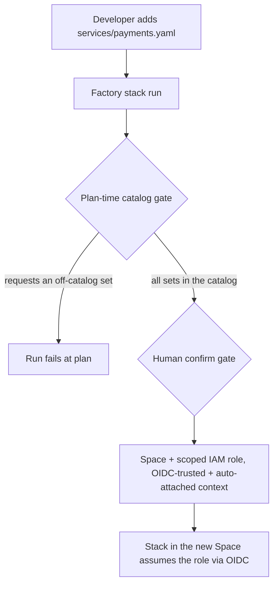

# Platform factory — role + space vending machine (`iam-factory`)

One administrative Spacelift stack that turns a git-tracked **DevX shopping
list** into real, secured environments. It manages Spacelift's per-Space AWS
access *as Terraform*.

## The loop

```
dev adds iam-factory/services/payments.yaml  ─push─▶  factory stack runs  ─▶  mints:
                                                                              ├─ Space  payments  (child of platform-admin)
                                                                              ├─ IAM role spacelift-payments  (boundary-capped, OIDC-trusted to that Space only,
                                                                              │            inline policy = union of the catalog sets it requested)
                                                                              └─ context aws-payments  (auto-attaches to `aws-oidc`-labeled stacks, exports TF_VAR_aws_role_arn)
```

A push under `iam-factory/` triggers the stack. Autodeploy is off, so the run
waits for a human confirm — the sign-off gate for every new Space and
credential boundary. (Swap in an approval policy for a richer gate.)

Because each role's trust policy pins the OIDC `sub` to `space:<id>:*`, a stack
in Space A physically cannot assume Space B's role, no matter what ARN it types.



*The vend loop: git request, plan-time gate, human sign-off, then Space-pinned credentials.*

## Shopping-list entry

`iam-factory/services/<slug>.yaml` (or `.yml`):

```yaml
name: payments                 # Space display name
description: Payments squad env # optional
# parent_space: <space-id>     # optional; must be parent_space_id or listed in
#                              #   var.allowed_parent_space_ids, else the plan fails.
permissions:                   # optional; catalog set names from catalog.yaml.
  - s3-readwrite               #   Omit -> var.default_permission_sets (["readonly"]).
  - dynamodb                   #   Any name NOT in the catalog fails the run.
  - sqs
  - logs-write
```

The filename (minus `.yaml`/`.yml`) is the slug used for the role/context
names. It must be lowercase alphanumeric/hyphen and at most 54 characters
(role names are `spacelift-<slug>`, capped at 64). One file per slug —
`payments.yaml` alongside `payments.yml` is rejected rather than silently
resolved.

`parent_space` is the one field that could move a vended Space out of the
subtree the factory governs, so it is an **allowlist**, not free text: only
`var.parent_space_id` and anything in `var.allowed_parent_space_ids` are
accepted. `name` and `description` are validated too, since both land in the
platform's own hierarchy.

## Permission catalog

`catalog.yaml` is the **platform-owned allowed universe**: a map of permission
*set* names to concrete IAM actions, either as a bare list or, when a set should
be resource-scoped, as `{ actions: [...], resources: [...] }`. Governance works
in four layers:

1. **The catalog gate (plan time).** `terraform_data.catalog_gate` fails the run
   if `catalog.yaml` is malformed, if a set is empty or holds something that
   isn't a `<service>:<Action>` pair, if `var.default_permission_sets` names a
   set that doesn't exist, or if the catalog grants an escalation-class action
   (`iam:*`, `sts:AssumeRole*`, `organizations:*`, `account:*`, `sso*`,
   `identitystore:*`, a bare `*` — see
   `var.forbidden_catalog_action_prefixes`). The boundary would block those at
   runtime anyway; this makes them ungrantable in the first place, so the two
   layers cannot drift apart.
2. **The request gate (plan time).** `terraform_data.permission_gate` fails the
   run if any service requests a set name not in `catalog.yaml`, if
   `permissions:` isn't a list of set names, if a service resolves to zero
   permissions, if the slug/name/description is malformed, or if `parent_space`
   is outside the allowlist. `terraform_data.request_gate` adds the set-wide
   checks: slug collisions and the `var.max_vended_services` cap. A developer
   cannot grant a role anything outside the catalog, no matter what they put in
   their YAML — expanding a set is a reviewed change to `catalog.yaml` itself.
3. **The scoped grant.** Each vended role gets a per-service inline policy
   (`spacelift-<slug>-scoped`) with **one statement per requested set**, each
   carrying that set's own `resources` — so resource scoping is expressible per
   set instead of everything sharing a blanket `"*"`. Setting
   `var.allowed_regions` additionally conditions every catalog statement on
   `aws:RequestedRegion`.
4. **The boundary (hard cap).** See below.

The `granted_actions` output shows, per service, the concrete actions its role
was granted; `vended` includes the requested set names; `boundary_posture`
publishes exactly what the boundary caps.

## The permissions boundary: allowlist, not denylist

The boundary used to be `Allow *` followed by a deny list. As a *cap* that is
less alarming than it reads — effective permissions are the intersection of the
boundary and the identity policy, and the identity policy here is the tightly
scoped catalog grant. But it did fail open in one real way: any service or
escalation path invented after the deny list was written would pass straight
through, and the boundary's whole job is to hold when the layer above it is
wrong.

So `var.boundary_mode` now defaults to **`catalog-services`**: the Allow
statement is derived from the catalog itself — the set of `<service>:*` prefixes
the catalog's actions actually touch. A vended role therefore cannot act outside
the services the catalog covers, however it is later policy-attached, and the
allowlist maintains itself: adding a set to `catalog.yaml` widens the boundary by
exactly that service and no more. `boundary_mode = "allow-all"` restores the
previous posture for accounts where vended roles legitimately need services
outside the catalog.

On top of the allowlist, in either mode:

- **Deny** `iam:*`, `organizations:*`, `account:*`, `sso:*`, `sso-directory:*`,
  `identitystore:*`, `sts:AssumeRole`, `sts:AssumeRoleWithSAML`,
  `sts:AssumeRoleWithWebIdentity`, `sts:GetFederationToken`, plus anything in
  `var.boundary_extra_denied_actions`. The `sts:AssumeRoleWith*` denials stop the
  *session* from chaining onward; they do not affect Spacelift assuming the role,
  which is an unsigned STS call and so not subject to the boundary.
- **Deny** everything when `aws:SecureTransport` is false. Services that don't
  set the key simply don't match, so this can never deny more than intended.

## How it runs

- **Administrative** (`administrative = true`) so the `spacelift` provider can
  manage Spaces/contexts, living in the locked-down **`platform-admin`** Space.
  It can only manage that Space's subtree — every vended Space is a child of it.
- Runs on the AWS integration passed as `aws_integration_id` (no default — see
  `bootstrap/iam-factory/terraform.tfvars.example`), whose role can manage IAM. In
  production, scope that role to just `iam:*Role*` / `iam:*Policy*` and bootstrap it
  out-of-band — it's the one role you can scope precisely.
- Bootstrapped from a **blueprint** so the factory stack itself is reproducible.

## Consuming stacks

The vended context uses `autoattach:aws-oidc`, so it only attaches to stacks
that **carry the `aws-oidc` label**. A stack in a vended Space *without* that
label gets nothing — it is one label of config, not zero. Create the stack in
the vended Space, add the `aws-oidc` label, and the context injects
`TF_VAR_aws_role_arn`. The provider block then points at the injected ARN and
the always-present OIDC token file:

```hcl
variable "aws_role_arn" { type = string } # injected by the auto-attached context

provider "aws" {
  assume_role_with_web_identity {
    role_arn                = var.aws_role_arn
    web_identity_token_file = "/mnt/workspace/spacelift.oidc"
  }
}
```

A complete reference stack (provider + `aws_caller_identity` proof) lives in
[`examples/consuming-stack/main.tf`](examples/consuming-stack/main.tf).

## Hardening beyond the MVP

Done:

- **Per-service scoping** — the catalog gate + per-set inline statements above.
- **Boundary as an allowlist** derived from the catalog, plus the widened
  escalation deny list and the TLS denial.
- **Resource-level scoping** — catalog sets can carry `resources:` ARN patterns;
  the shipped sets still grant on `"*"`, so tighten them per environment.
- **Region lock** — `var.allowed_regions`, opt-in. Left off by default because
  global-endpoint services (S3 `ListAllMyBuckets`, STS, IAM) report
  `us-east-1`, so a careless lock breaks them in a way that looks like a
  permissions bug.
- **Bounded `parent_space`, validated names, capped service count** — the
  request gates above.

Remaining:

- **Split read/write roles** — `var.trust_scopes` defaults to
  `["write", "read"]`, so proposed-run (PR) plans still get **write-capable**
  credentials from a single ARN. Vend a `-read` twin with `trust_scopes =
  ["read"]` and readonly sets, and set the write role to `["write"]`, so PRs
  plan read-only.
- **Approval policy** on the factory instead of relying on manual confirm.
- **OIDC thumbprint** — `thumbprint_list` uses the leaf certificate's
  fingerprint. AWS no longer validates thumbprints for providers backed by
  well-known CAs, so this is cosmetic today; the root of the returned chain is
  the more correct choice.
- Note the blanket `iam:*` deny also blocks `iam:PassRole` **and**
  `iam:CreateServiceLinkedRole`, so workloads that pass roles to Lambda/ECS or
  create service-linked roles (e.g. some autoscaling/ELB setups) will fail —
  loosen those two per-workload, scoped to specific role ARNs, rather than
  opening `iam:*`.
