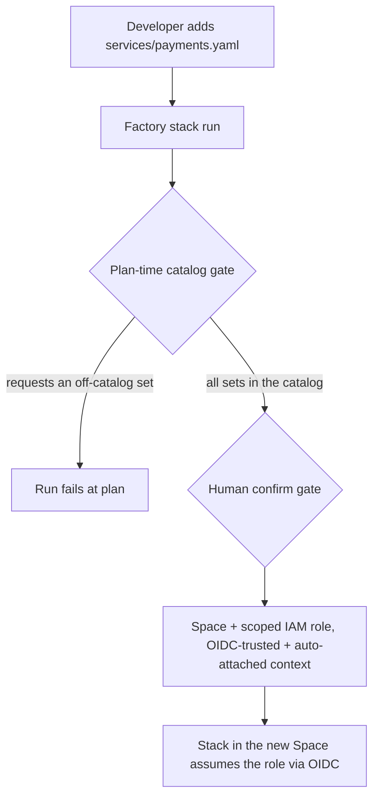

# Platform factory — role + space vending machine (`iam-factory`)

One administrative Spacelift stack that turns a git-tracked **DevX shopping
list** into real, secured environments. It manages Spacelift's per-Space AWS
access *as Terraform*.

## The loop

```
dev adds iam-factory/services/payments.yaml  ─push─▶  factory stack runs  ─▶  mints:
                                                                              ├─ Space  payments  (child of platform-admin)
                                                                              ├─ IAM role spacelift-payments  (boundary-capped, OIDC-trusted to that Space only,
                                                                              │            inline policy = union of the catalog sets it requested)
                                                                              └─ context aws-payments  (auto-attaches to `aws-oidc`-labeled stacks, exports TF_VAR_aws_role_arn)
```

A push under `iam-factory/` triggers the stack. Autodeploy is off, so the run
waits for a human confirm — the sign-off gate for every new Space and
credential boundary. (Swap in an approval policy for a richer gate.)

Because each role's trust policy pins the OIDC `sub` to `space:<id>:*`, a stack
in Space A physically cannot assume Space B's role, no matter what ARN it types.



*The vend loop: git request, plan-time gate, human sign-off, then Space-pinned credentials.*

## Shopping-list entry

`iam-factory/services/<slug>.yaml` (or `.yml`):

```yaml
name: payments                 # Space display name
description: Payments squad env # optional
# parent_space: <space-id>     # optional; defaults to the platform-admin Space
permissions:                   # optional; catalog set names from catalog.yaml.
  - s3-readwrite               #   Omit -> var.default_permission_sets (["readonly"]).
  - dynamodb                   #   Any name NOT in the catalog fails the run.
  - sqs
  - logs-write
```

The filename (minus `.yaml`/`.yml`) is the slug used for the role/context
names. It must be lowercase alphanumeric/hyphen and at most 54 characters
(role names are `spacelift-<slug>`, capped at 64).

## Permission catalog

`catalog.yaml` is the **platform-owned allowed universe**: a map of permission
*set* names to concrete IAM actions. Governance works in three layers:

1. **The gate (plan time).** `terraform_data.permission_gate` fails the
   factory run if any service requests a set name not in `catalog.yaml`, if a
   service resolves to zero permissions, or if the slug is malformed. A
   developer cannot grant a role anything outside the catalog, no matter what
   they put in their YAML — expanding a set is a reviewed change to
   `catalog.yaml` itself.
2. **The scoped grant.** Each vended role gets a per-service inline policy
   (`spacelift-<slug>-scoped`) whose actions are exactly the union of the
   catalog sets it requested — replacing the old blanket AdministratorAccess
   attachment.
3. **The boundary (hard cap).** The `spacelift-space-boundary` permissions
   boundary still applies to every role: no `iam:*`, `organizations:*`,
   `account:*`, or role-chaining via `sts:AssumeRole*` — even if a catalog set
   were ever over-broadened, escalation stays blocked. Defense in depth.

The `granted_actions` output shows, per service, the concrete actions its role
was granted; the `vended` output includes the requested set names.

## How it runs

- **Administrative** (`administrative = true`) so the `spacelift` provider can
  manage Spaces/contexts, living in the locked-down **`platform-admin`** Space.
  It can only manage that Space's subtree — every vended Space is a child of it.
- Runs on the **`two`** AWS integration (account `025897764844`), whose role can
  manage IAM. In production, scope that role to just `iam:*Role*` / `iam:*Policy*`
  and bootstrap it out-of-band — it's the one role you can scope precisely.
- Bootstrapped from a **blueprint** so the factory stack itself is reproducible.

## Consuming stacks

The vended context uses `autoattach:aws-oidc`, so it only attaches to stacks
that **carry the `aws-oidc` label**. A stack in a vended Space *without* that
label gets nothing — it is one label of config, not zero. Create the stack in
the vended Space, add the `aws-oidc` label, and the context injects
`TF_VAR_aws_role_arn`. The provider block then points at the injected ARN and
the always-present OIDC token file:

```hcl
variable "aws_role_arn" { type = string } # injected by the auto-attached context

provider "aws" {
  assume_role_with_web_identity {
    role_arn                = var.aws_role_arn
    web_identity_token_file = "/mnt/workspace/spacelift.oidc"
  }
}
```

A complete reference stack (provider + `aws_caller_identity` proof) lives in
[`examples/consuming-stack/main.tf`](examples/consuming-stack/main.tf).

## Hardening beyond the MVP

- **Per-service scoping is built in** — the catalog gate + inline policy above
  (formerly a TODO). Next steps below tighten what remains.
- **Split read/write roles** — the single vended role trusts both `scope:read`
  and `scope:write` subs, so proposed-run (PR) plans get **write-capable**
  credentials. Vend a `-read` twin (readonly sets, trust `scope:read` only)
  and pin the write role's trust to `scope:write` so PRs plan read-only.
- **Approval policy** on the factory instead of relying on manual confirm.
- **Tighten the boundary** — region locks, deny `s3:DeleteBucket` on the state
  bucket, etc. Note the blanket `iam:*` deny also blocks `iam:PassRole` **and**
  `iam:CreateServiceLinkedRole`, so workloads that pass roles to Lambda/ECS or
  create service-linked roles (e.g. some autoscaling/ELB setups) will fail —
  loosen those two per-workload, scoped to specific role ARNs, rather than
  opening `iam:*`.
- **Resource-level scoping** — catalog sets grant actions on `Resource = "*"`;
  a richer catalog could carry resource ARN patterns per set.
