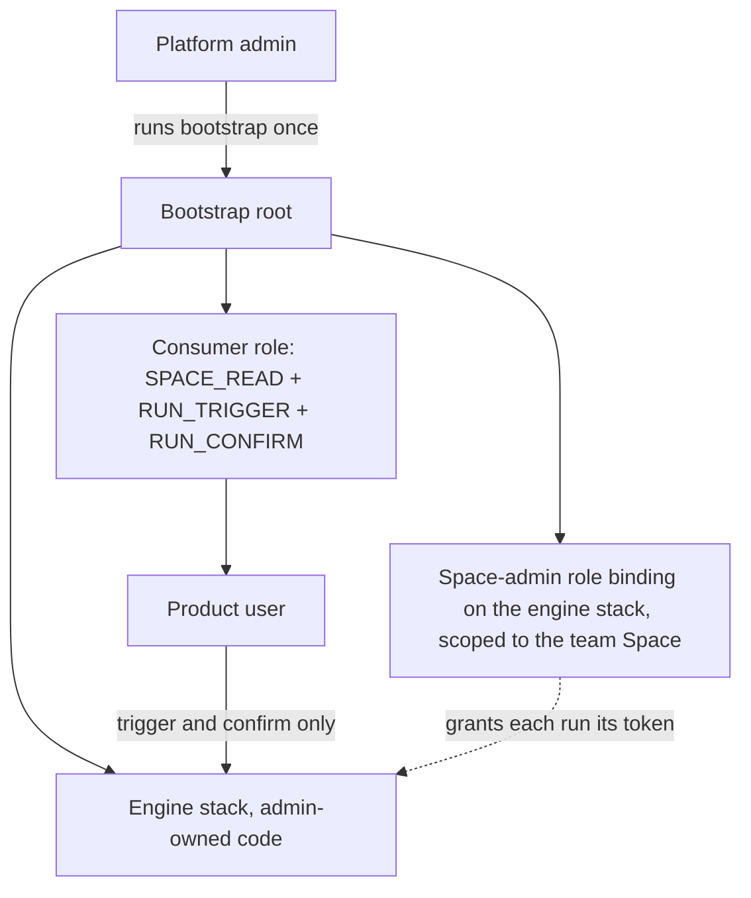
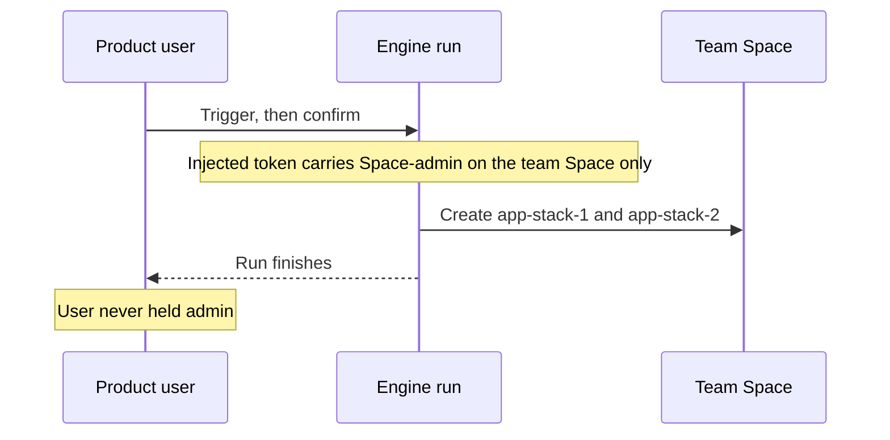

# Pattern: non-admin launcher

Product teams self-serve stack provisioning **without ever holding Space
Admin**. The privilege lives on a stack, not on any person.

## Why not just let the team deploy a Template that grants the elevation?

This is the question that motivates the whole pattern. The intuitive design —
a product-team user deploys a governed Template/Blueprint into their Space, and
the Template attaches Space Admin to the launcher stack — **cannot work, by
design**:

- A Blueprint runs with the **deploying user's** permissions, and Spacelift
  enforces that you cannot grant a role you do not hold. So a Template that
  attaches Space Admin requires the deployer to already *be* Space Admin.
- You cannot safely hand product teams Space Admin: it also grants
  `STACK_UPDATE`, letting them edit the `env:*` labels that policy guardrails
  depend on — i.e. bypass the guardrails.
- There is no narrower permission that allows creating a role binding without
  that label/space power, and there shouldn't be: **granting authority is
  inherently privileged.** If a non-admin could deploy a Template that grants
  admin to a stack, they could edit that Template (or its inputs) to elevate
  themselves. The check is the anti-escalation boundary working correctly.

**The resolution is to decouple *creating* the elevation from *using* it.** The
elevation is created **once, by an admin** (`bootstrap/`), and bound to the
launcher *stack* — not to any user. Product-team users never deploy the
privileged object; they only **trigger** the pre-elevated stack. The deploying
identity is never the thing that creates the elevation, so it never needs the
elevated permission.



*The decoupling: an admin creates the elevation once, on the stack; product users hold only the trigger.*

## How it works

1. The platform team (root admin) runs `bootstrap/nonadmin-launcher/` **once
   per team**. It creates a governance Space (`platform`), the team's Space,
   the admin-owned **engine stack**, and the single privileged object: a
   `spacelift_role_attachment` binding the system **Space admin** role to the
   *engine stack*, scoped to the team's Space.
2. The engine stack tracks `patterns/nonadmin-launcher/engine/` (this
   directory) — admin-owned Terraform that reads a git-tracked YAML shopping
   list (`requests/*.yaml`) and vends `app-stack-*` into the team Space. Its runs receive a short-lived injected
   `SPACELIFT_API_TOKEN` carrying exactly the team-Space-scoped admin
   permission from the role binding, independent of who triggered the run.
3. Product-team users hold only a non-admin consumer role
   (`SPACE_READ` + `RUN_TRIGGER` + `RUN_CONFIRM`), attached **stack-scoped to
   the engine stack only** — they can trigger and confirm this one governed
   entry point, nothing else in the `platform` Space. No `SPACE_ADMIN`, no
   `STACK_UPDATE`, so they cannot edit labels or attach roles.

A note on the deprecated `administrative` flag: the engine stack does **not**
use it — the API removed the attribute (disabled June 1, 2026). The role
binding is the mechanism and the supported replacement.



*A run acts with the stack's binding, never with the caller's permissions.*

## Layout

| Directory | What it is |
|---|---|
| `engine/` | The Terraform the engine stack runs. Teams never edit it. |
| `engine/requests/` | Git-tracked shopping list — one YAML per app stack; teams add a file via PR. |
| `engine/app-example/` | Placeholder workload the vended app stacks track. |
| `../../bootstrap/nonadmin-launcher/` | The root-admin, one-time provisioning of Spaces, engine, binding, and roles. |

## The request schema — data, and only the data

`engine/requests/<slug>.yaml` (or `.yml`). The filename minus the extension is
the slug; one file per slug.

```yaml
name: app-stack-1          # optional; defaults to the slug
# project_root: <path>     # optional, and only from var.allowed_project_roots
```

Those two keys are the **whole** schema, and `terraform_data.request_gate` fails
the plan on anything else. The engine runs with the elevated token, so the
requests are the one thing a non-admin controls and they get treated as
untrusted input:

- **`project_root` is an allowlist.** A free-form override would let a team point
  a vended stack at *any* directory in this repo — `bootstrap/`,
  `patterns/iam-factory`, another team's pattern — and the vended stack would
  then run that Terraform with whatever the team Space's integrations grant. A
  path is a privilege decision, not a request field, so only
  `var.vended_project_root` plus `var.allowed_project_roots` are accepted;
  by default a request cannot override it at all.
- **Any other key is rejected**, `labels:` above all. The access and plan
  policies key off `env:*` and `team:*` labels, so a request that could set them
  could route itself around the guardrails.
- **The `env:` label is the engine's**, from `var.vended_env` — `dev` or `stage`
  only, the lanes `bootstrap/environments` and
  `policies/plan/protect-env-labels.rego` know about. `prod` is deliberately not
  offered: `policies/plan/launcher-engine-guardrail.rego` treats `env:prod` as a
  privilege claim an engine may not make. The label used to be hardcoded to
  `env:d`, which matched no lane at all. Stacks vended before this change carry
  `env:d`; relabelling them is itself a stack update that
  `protect-env-labels.rego` will deny, so either set `TF_VAR_vended_env` to keep
  the old value during migration or relabel them deliberately through the policy
  exception path.
- Slugs, `name`, request count (`var.max_requests`) and `.yaml`/`.yml`
  collisions are all validated at plan time, before the elevated token creates
  anything. The slug and name shapes and the request cap deliberately mirror
  `policies/plan/launcher-engine-guardrail.rego`, so the in-code gate fails first
  with a message that says what to change.

## The trust chain

- **Who can change what the engine does?** Only whoever can merge to this
  repo's tracked branch — the engine executes admin-owned code; teams supply
  inputs (the shopping list) only.
- **Who can make the engine act?** Only holders of the consumer role, and only
  via `RUN_TRIGGER`; `autodeploy = false` parks every run at a confirm gate.
- **What can a run do at most?** Space-admin inside the one team Space the
  binding is scoped to. It cannot touch `root`, sibling teams, or the
  `platform` Space itself.
- **Can a Space see its neighbors' or root's secrets?** No. Both Spaces are
  created with `inherit_entities = false`, so no parent/root context,
  integration, or policy leaks in. Because nothing is inherited, the platform
  admin attaches what each Space needs directly (disabling inheritance is a
  root-only op, so it's done in the bootstrap — the non-root engine can't reach
  root-level integrations anyway).

## Current status (PoC)

The shopping list is git-tracked YAML (`engine/requests/*.yaml`), matching
`patterns/iam-factory`'s `services/` — teams add reviewed-in-git data, never
code. Deferred hardening (branch protection, approval/push/plan policies,
private worker pool) is tracked in
[`docs/hardening-backlog.md`](../../docs/hardening-backlog.md).
